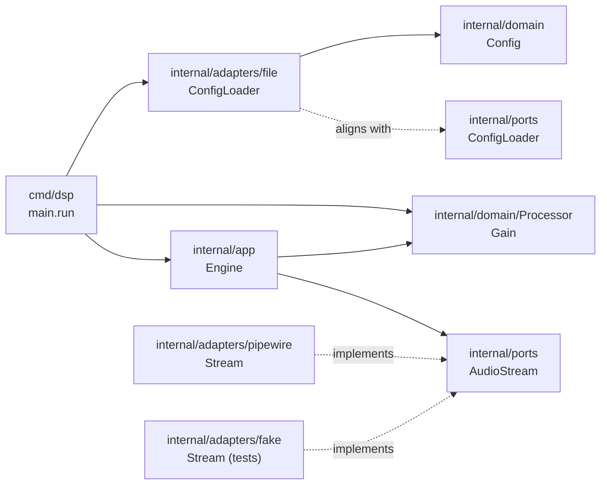

# Architecture  
  
## Overview

This project uses hexagonal architecture to isolate DSP logic from I/O.

## Mermaid Graph



Current runtime path from the code:

```mermaid
flowchart LR
    Args["CLI args"] --> Main["cmd/dsp/main.go"]
    Main --> Load["file.ConfigLoader.Load"]
    Load --> Config["domain.Config"]
    Config --> Gain["domain.NewGain"]
    Gain --> Engine["app.NewEngine"]
    Engine --> Run["engine.Run"]
    Run --> Stream["pipewire.Stream.Start"]
    Stream --> Process["processor.ProcessInPlace"]
```



## Layer

### 1. CLI (cmd/dsp)

- Parses arguments
- Loads config
- Starts engine

### 2. App Layer (Engine)

- Orchestrates DSP processing
- Connects ports and adapters

### 3. Domain (DSP Core)

- Pure signal processing
- No dependencies on I/O
- Fully testable

### 4. Ports

Interfaces that define external behavior:

- AudioStream
- ConfigLoader

### 5. Adapters

Implement ports:
  
- PipeWire (real audio)
- File (JSON config)
- Fake (testing)

## Audio Flow

```
PipeWire → Engine → DSP → PipeWire
```

In tests, the audio flow is:

```
Fake Stream → Engine → DSP
```

## Key Design Constraints

- DSP must be pure
- Real-time safe processing
- Zero allocations in hot path
- PipeWire isolated from domain

## Future Evolution

- Add more DSP processors
- Support multi-channel audio
- Optimize latency and memory usage
